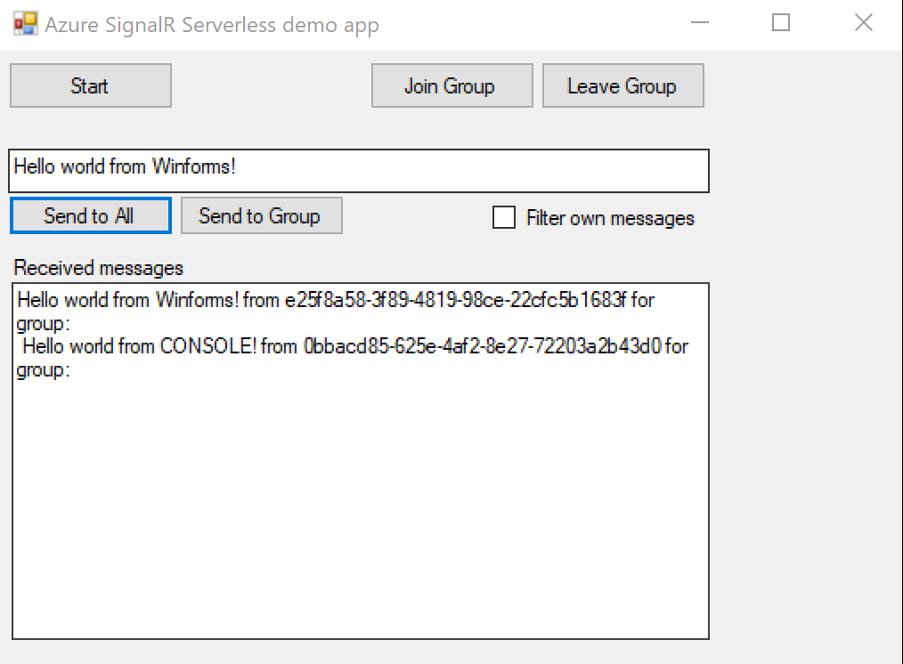
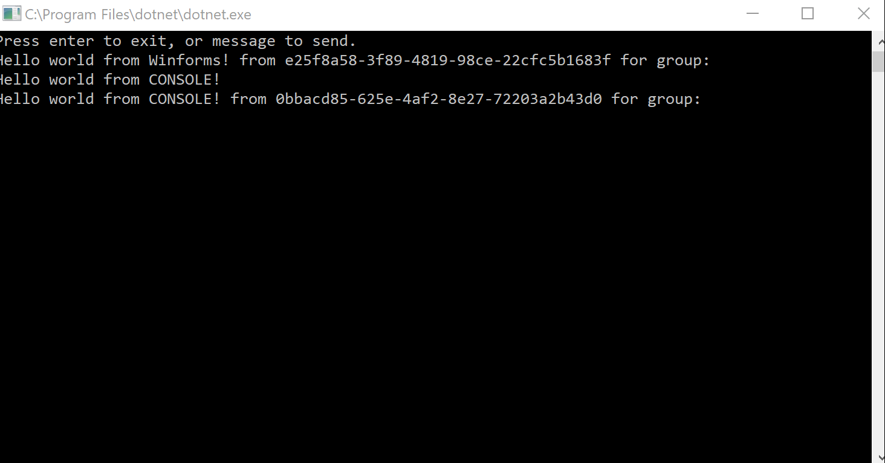

Part of the Serverless Azure-based .Net 2.0 Standard Broadcast solution. 

[](https://dev.azure.com/bitfox/AzureBroadcast.Client/_build/latest?definitionId=5&branchName=master)

# Introduction

Azure provides a fully managed and scalable SignalR service for real-time communication, but... It still requires a back-end to trigger messages. Fortunately you can use Azure Functions for that to get a full serverless experience! A lot of sample implementations of these functions exists, but they are either incomplete or complex. 

This solution gives you a [predefined set of Azure Functions](https://github.com/bitfox-git/azurebroadcast-functions), along with this corresponding client library to get you started with real-time communication in any (desktop, web) .net standard 2.0 application. With your own custom message structure and grouping.

 
## AzureBroadcast.Client 
A .net standard 2.0 client-side library to be used alongside the Azure Functions and Azure SignalR service for a full serverless setup. 


## Basic usage of client

Simple string based broadcasting:

``` csharp
    var client = new BroadcastClient<string>('endpoint-of-azure-functions','hostkey');

    client.onMessage = (msg, info) => { 
        //do something usefull with received messages;
    }

    client.Start();
    client.Send("Hello World!");

```` 

You can also provide your own message structure:

``` csharp
    public class MyMessage() {
        public DateTime timestamp;
        public string message;
    }

    var client = new BroadcastClient<MyMessage>('endpoint-of-azure-functions');
    client.onMessage = (msg, info) => { 
        //msg.message
        //msg.timestamp ...
    }
```

## Features

Seperating on channels or groups or topics:
``` csharp
client.JoinGroup('my-test-channel');
client.LeaveGroup('my-test-channel'); 
```

Sending to specific groups or a specific user

``` csharp
client.SendToGroup(msg, 'my-test-channel');
client.SendToUser(msg, 'some user id'); 
```

Filter echoing
``` csharp
client.FilterOwnMessages = true;
```


## Design considerations

In short: this setup sees Azure SignalR and Azure Functions as *Infrastructure* only. Any logic, grouping, multiple actions, multiple message, should be done on top of this, inside your application(s). 

SignalR provide several options to seperate between things like: multiple message structures, the methods being called on the receiver and multiple hubs. This library uses only one hub and one client method (onMessage) and one (custom) message, with the idea that for most use cases it's sufficient to see SignalR as communication medium only and solve other needs on a higher level.

For example: Seperating clients can be done within one hub by joining and leaving groups. Multiple actions on the clients can be achieved by adding an `action` property in your custom messages and respond accordingly to it's received value. This whole idea speeds up the development process because new actions, new channels can be done without any changes to the Azure setup of both Azure SignalR service as well as the Azure Functions, once deployed, you're done. On the down side you will have to fit everything in one message format (action, parameters, messages, etc.) which could result in larger transfers because of unused fields in your message.


## Installation

This client library is provided as [NuGet package](https://www.nuget.org/packages/Bitfox.AzureBroadcast.Client/).

Make sure you setup the corresponding Azure Functions and Azure SignalR service as pointed out [here](https://github.com/bitfox-git/azurebroadcast-functions).

## Samples

Sample projects using this library can be found in the samples folder: a WinForms (Framework 4.6.1) and a Console (Core 2.1) application. 

Winforms and Console working with the same libary:






But it should also work in Xamarin, Unity and ASP.NET projects as well.


